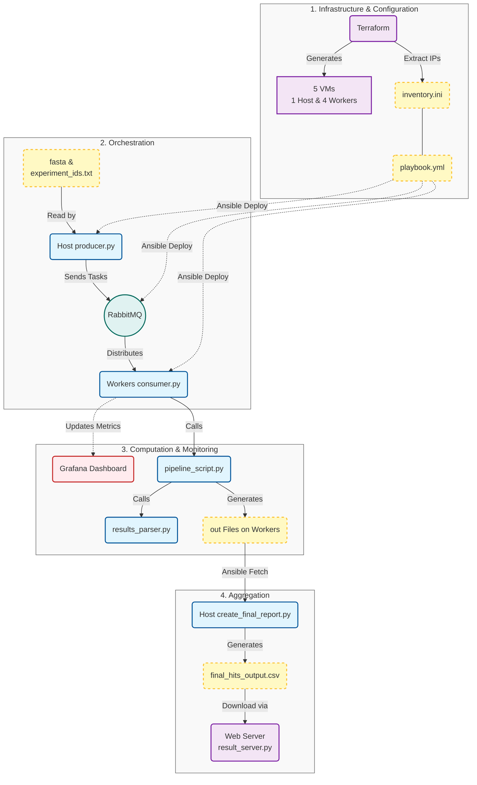

# Distributed Protein Structure Prediction Pipeline

## Overview

This repository contains a distributed data analysis system for predicting protein structures using the S4Pred and HHSearch machine learning tools. The system scales horizontally across a cluster of cloud instances to efficiently process large datasets of protein sequences.

The pipeline is designed to be **reproducible**, **fault-tolerant**, and features **real-time monitoring** of both infrastructure and application logic.

## System Architecture

Here is the diagram of distributed system:


---

## Phase 1: Infrastructure Provisioning (Terraform)

### 1. Initialize Terraform:
```bash
terraform init
```

### 2. Provision the cluster (1 Host, 4 Workers):
```bash
terraform apply
```

### 3. Generate the Ansible inventory file:
* This script extracts IPs from Terraform output and creates `inventory.ini`.
```bash
python3 generate_inventory.py
```

---

## Phase 2: Configuration & Deployment (Ansible)

This phase automates the setup of software, transfers python scripts, and configures monitoring.

### 1. Test Connectivity:
```bash
ansible -i inventory.ini workers -m ping
```

### 2. Run the Playbook:
```bash
ansible -i inventory.ini playbook.yml
```

---

## Phase 3: Execution Pipeline

### 1. Upload Data to Host

Before running the analysis, upload the dataset and ID list to the **Host machine**.
```bash
scp -i ~/.ssh/id_rsa UP000000589_10090.fasta experiment_ids.txt almalinux@10.134.12.209:/home/almalinux/
```
10.134.12.209: host ip 

### 2. Start Consumers (Workers)

The consumer script listens to RabbitMQ and executes `pipeline_script.py` when a message arrives.

```bash
ansible -i inventory.ini workers -m shell -a "nohup python3 -u /home/almalinux/consumer.py > consumer.log 2>&1 &"
```

### 3. Start Producer (Host)

SSH into the Host and launch the producer to populate the queue.
```bash
python3 producer.py
```
The producer reads the target list from experiment_ids.txt and scans the UP000000589_10090.fasta dataset. It filters out only the matching protein sequences and dispatches them to the RabbitMQ task_queue.

---

## Phase 4: Monitoring (Grafana)

While the pipeline runs, monitor the cluster status in real-time.

* **URL:** `http://<Host-IP>:3000`
* **Credentials:** `admin` / `admin`
* **Dashboard:** Import the provided Grafana.json file to view

---

## Phase 5: Result Aggregation & Reporting

Since the analysis results (`.out` files) are distributed across the worker nodes, they must be fetched back to the host for aggregation.

### 1. Fetch Results from Workers
Since Ansible's fetch module does not support wildcards efficiently, we first compress the results on the workers, fetch the archives, and then extract them.

Step A: Compress results on all workers Create a tarball of all .out files on each worker node.
```bash
ansible -i inventory.ini workers -m shell -a "tar -czf /home/almalinux/results.tar.gz -C /home/almalinux ./*.out"
```
Step B: Fetch tarballs to Host Download the results.tar.gz from each worker to a local directory named collected_results/. (Ansible will automatically create subdirectories for each worker, e.g., collected_results/worker-0/...)

```bash
ansible -i inventory.ini workers -m fetch -a "src=/home/almalinux/results.tar.gz dest=collected_results/"
```
Step C: Extract all results to final folder Unzip all the fetched tarballs into the single final_data/ directory for processing.

```bash
mkdir -p final_data
find collected_results -name "results.tar.gz" -exec tar -xzf {} -C final_data \;
```

### 2. Generate Final Report

Run the reporting script to parse the collected files, filter out errors (NaN), and calculate statistics.
```bash
python3 create_final_report.py
```

### 3. Start Web Server & Download Results
Start the Flask server to host the generated CSV files.

```bash
python3 result_server.py
```
Open browser and go to http://<HOST_IP>:5000
Click the links to download final_hits_output.csv or final_profile_output.csv.


**Outputs:**
* `final_hits_output.csv`: Best hit for each protein.
* `final_profile_output.csv`: Statistical summary.
* `missing_ids.txt`: List of failed or missing sequences.

## File Descriptions

* **Infrastructure & Config**
  * `main.tf`, `variables.tf`: Terraform definitions.
  * `playbook.yml`: Main Ansible configuration.
  * `inventory.ini`: Generated list of IP addresses.

* **Application Logic**
  * `producer.py`: Reads FASTA, sends JSON payloads to RabbitMQ.
  * `consumer.py`: Listens to Queue, creates temp files, calls pipeline, updates Prometheus metrics.
  * `pipeline_script.py`: Wrapper for S4Pred and HHSearch execution.
  * `results_parser.py`: Extracts statistical data from HHSearch raw output.

* **Reporting**
  * `create_final_report.py`: Aggregates distributed `.out` files into CSVs.
  * `result_server.py`: Flask app for serving results.

* **Monitoring**
  * `Grafana.json`: Dashboard configuration.

* **Other**
  * `reset_demo.sh`: Script to clean state and restart workers.

